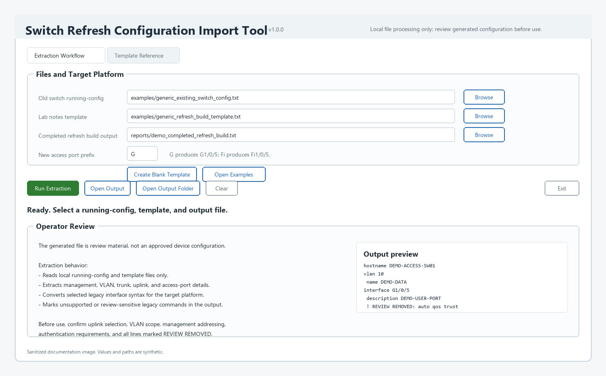

# Switch Refresh Configuration Import Tool

[](https://github.com/wmmunn/Switch-Refresh-Configuration-Import-Tool/actions/workflows/tests.yml)
[](https://snyk.io/test/github/wmmunn/Switch-Refresh-Configuration-Import-Tool?targetFile=requirements.txt)

Import selected values from an existing switch configuration into a reviewable
refresh build template, and optionally plan a target switch build sheet through
an explicit profile-driven mapping engine.

This local Windows GUI reads an existing Cisco IOS switch configuration, applies
parsing logic, and fills a prepared refresh build template with reusable values.
Version 1.1.0 adds the Target Build Planner: a review-gated engine path that
parses source interfaces, applies a user-owned target profile, exposes mapping
evidence, and renders a human-reviewable new switch build sheet.

The public edition ships only with fictional sample data. It does not connect
to network devices, transmit commands, or require credentials.



The image uses synthetic paths, placeholder device names, and fictional
configuration snippets.

## Features

- Imports hostname, VTP domain, management addressing, VLANs, trunks, likely
  uplinks, access-port blocks, and RADIUS/dot1x status into a template.
- Adds a Target Build Planner workflow for explicit source-to-target interface
  mapping.
- Supports target profiles for access-port naming, mixed target interface
  layouts, stack member mapping, and explicit uplink destinations.
- Exposes collisions, unmapped interfaces, stack member shifts, unsupported
  interface names, trunk evidence, and malformed parser blocks instead of
  silently guessing.
- Renders review notes and warnings as Cisco comment lines beginning with `!`.
- Keeps generated output gated by operator review.
- Uses a bundled generic refresh build template and existing-switch config.
- Processes files locally.
- Runs with standard Tkinter; `ttkbootstrap` is optional.

## Repository Layout

```text
.
|-- examples/                              # Generic input files
|-- docs/                                  # Project history and design notes
|-- src/switch_refresh_config_import_tool/ # Application source and bundled assets
|-- tests/                                 # Sanitization and extraction tests
|-- .github/workflows/tests.yml            # Public CI
|-- SwitchRefreshConfigurationImportTool.spec
|-- pyproject.toml
|-- LICENSE
`-- README.md
```

## Quick Start

Python 3.10 or newer is required.

```powershell
python -m venv .venv
.\.venv\Scripts\Activate.ps1
python -m pip install -e .[theme]
switch-refresh-config-import-tool
```

For dependency scanners that expect a classic Python manifest, `requirements.txt`
lists the optional GUI theme dependency.

The application starts with these generic inputs selected:

- `examples/generic_existing_switch_config.txt`
- `examples/generic_refresh_build_template.txt`

Choose an output path, run extraction, and review the generated text before
using any portion of it.

The original **Extraction Workflow** tab remains available for the simple
template-fill path. Its `Legacy output port prefix` dropdown controls only that
legacy workflow.

The **Target Build Planner** tab is the newer profile-driven workflow. It uses:

1. A source running-config.
2. A target profile that defines interface naming and uplink mapping rules.
3. A review output template.
4. A new switch build sheet output path.

The Target Build Planner does not infer a target design from switch model names
or source interface names. Target interface naming is profile-owned. Operators
can use the visible Target Profile Options controls for common layouts, or save
and review the generated JSON profile when deeper customization is needed.

## Template Customization

The refresh build template is intentionally a plain text file. Users can adapt
it to match their own base-build standards, review workflow, change-control
language, and required placeholders.

The tool fills supported placeholders with targeted values from the existing
configuration. It does not prescribe a complete target architecture, replace an
organization's standard base configuration process, or harvest unsupported
sections from the old switch config.

Supported extracted values in the current public release include:

- Switch identity, including hostname and VTP domain.
- Management VLAN, management IP address, subnet mask, and default gateway.
- VLAN creation entries discovered in the source config.
- Observed trunk allowed VLAN lists.
- Likely uplink/trunk interface blocks.
- Access-port interface blocks, including descriptions, access VLANs, voice
  VLANs, shutdown state, and supported edge-port lines.
- RADIUS/dot1x presence or status for operator review.

Unsupported or organization-specific sections, such as ACLs, SNMP, logging,
NTP, QoS policy, banners, and full AAA policy, are not broadly harvested into
the template by default. They should be handled through the user's normal
architecture standards and review process unless a future profile or template
explicitly supports them.

## Target Build Planner

The Target Build Planner breaks the refresh process into smaller, testable
parts:

- `source_parser.py` reads the raw source configuration and produces structured
  `SourceSwitchConfig` data.
- `profile_schema.py` loads the target profile into typed schema objects.
- `mapping_engine.py` combines the source config and target profile into a
  `TargetRefreshPlan`.
- `plan_renderer.py` renders that plan into template placeholders for a
  reviewable new switch build sheet.
- The Tkinter GUI gathers operator choices, runs the engine, and displays the
  audit panel and preview. It does not own the mapping logic.

The engine follows an "Expose, Don't Guess" rule:

- Unsupported interface names are left unmapped.
- Missing stack member mappings are warning conditions.
- Non-identity stack member mappings are flagged for review even when they are
  collision-free.
- Target interface collisions are critical findings with shared collision
  evidence on every affected mapping.
- Uplinks and port-channel members remain visible and review-gated.
- Dot1x/RADIUS is visibility-only in this release; it is not translated into a
  target authentication design.

All generated output remains review material. A clean audit panel does not mean
the output is approved for device deployment.

## Run Tests

```powershell
python -m unittest discover -s tests -v
```

## Project History

The longer sanitized revision trail is kept in
[`docs/project-history.md`](docs/project-history.md). Use it when tracking
regressions or understanding why a safety behavior exists.

Recoverable legacy source snapshots are preserved locally outside the public
repository. They are not included in the GitHub-ready source tree because older
exact snapshots may contain non-public attribution or internal lineage details.

Archive/cleanup rules are documented in
[`docs/archive-policy.md`](docs/archive-policy.md). Project artifacts should be
archived before deletion, renaming, or replacement.

Public release packaging should follow
[`docs/release-checklist.md`](docs/release-checklist.md).

Future planning is tracked in [`docs/roadmap.md`](docs/roadmap.md). Current
Target Build Planner architecture notes are documented in
[`docs/profile-engine-design-notes.md`](docs/profile-engine-design-notes.md).

## Build The Windows EXE

```powershell
python -m pip install -e .[build,theme]
pyinstaller --noconfirm --clean SwitchRefreshConfigurationImportTool.spec
```

The executable is written to `dist/SwitchRefreshConfigurationImportTool.exe`.
Publish the binary through a GitHub Release rather than committing it to the
repository.

## Sanitized Examples

The generic existing-switch config uses names prefixed with `DEMO` and IP
addresses from the RFC documentation ranges:

- `192.0.2.0/24`
- `198.51.100.0/24`
- `203.0.113.0/24`

Do not submit real customer configs, credentials, logs, screenshots, or
production addressing in issues or pull requests.

## Safety

Generated output is review material, not an approved device configuration.
Confirm interface mappings, VLAN scope, uplinks, management addressing,
authentication behavior, and every line marked for review.

For stack refresh work, users are responsible for building and verifying the
new stack before applying any generated configuration. Confirm physical stack
member order, member numbering, target interface orientation, and that the
intended active/master switch is in control before using imported interface
configuration.

Cisco and Cisco IOS are trademarks of Cisco Systems, Inc. This project is
independent and is not affiliated with or endorsed by Cisco.

## License

MIT License. See [LICENSE](LICENSE).

## Release Notes

See [RELEASE_NOTES_v1.1.0.md](RELEASE_NOTES_v1.1.0.md) for the current public
release summary. The original v1.0.0 baseline notes remain in
[RELEASE_NOTES_v1.0.0.md](RELEASE_NOTES_v1.0.0.md).


